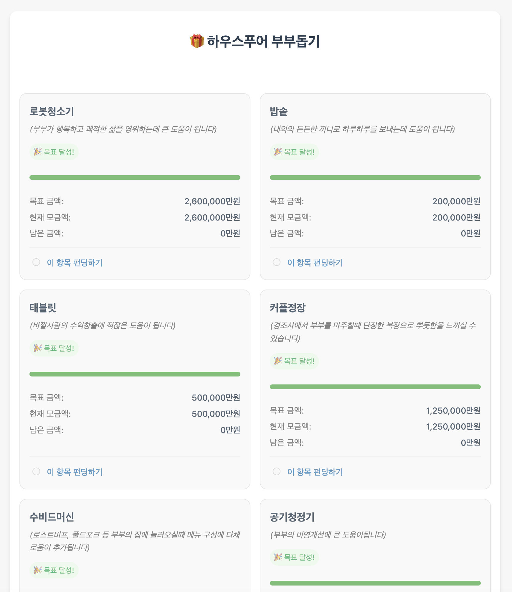

# 결혼 축의금 펀딩 페이지 🎁

축의금을 "이 부부에게 필요한 항목"으로 바꿔서, 하객이 항목을 골라 펀딩하는 결혼 선물 펀딩 페이지입니다.
GitHub Pages에 올리는 정적 웹페이지 하나 + 구글 시트로 동작해서, **서버 없이 무료로** 운영할 수 있어요.

> 이 저장소를 그대로 가져가서(fork/복사) 본인 결혼식용으로 고쳐 쓰는 것을 전제로 만든 템플릿입니다.

## 기능

- 구글 시트에 적어둔 펀딩 항목을 목표금액/현재모금액과 함께 진행바로 표시
- 하객이 항목을 선택하고 이름·금액을 입력하면 구글 시트에 자동 기록
- 계좌번호 클릭 시 클립보드 복사 + QR 이미지 안내
- 30초마다 모금 현황 자동 갱신

## 구성

| 파일 | 역할 |
|---|---|
| `index.html` | 페이지 본문 (제목·계좌·QR·펀딩 폼) — **여기서 신랑신부 정보 수정** |
| `script.js` | 펀딩 로직 + 구글 시트 연동 — **여기에 Apps Script URL 입력** |
| `style.css` | 스타일 |
| `resources/` | 예시 스크린샷 등 이미지 리소스 (본인 QR 이미지도 여기에) |
| `.github/workflows/deploy.yml` | `main`에 push하면 `gh-pages`로 자동 배포 |

동작 구조는 이렇습니다:

```
[하객 브라우저] ──GET──▶ [Google Apps Script] ──▶ [Google Sheet]
   (index.html)   ◀─JSON─                          (펀딩 항목/현황)
        │
        └──────POST(이름·금액·항목)──▶ 시트에 기록
```

---

## 사용 방법

### 1. 저장소 복사

이 저장소를 fork 하거나 파일을 통째로 복사해서 본인 GitHub 저장소를 만듭니다.

### 2. 구글 시트 + Apps Script 백엔드 만들기

1. 새 **구글 시트**를 만들고 첫 행을 헤더로, 아래 순서대로 열을 구성합니다.

   | A: 상품명 | B: 부가설명 | C: 목표액수 | D: 현재모금액 |
   |---|---|---|---|
   | 냉장고 | 신혼집 필수템 | 150 | 0 |
   | 신혼여행 | 몰디브 | - | 0 |

   - 목표액수 단위는 **만원**이며, 목표가 없는 항목은 `-` 로 둡니다.
   - 현재모금액은 `0` 으로 시작하면 됩니다.

2. 시트 상단 메뉴 **확장 프로그램 → Apps Script** 를 열고,
   - `doGet` : 위 시트를 읽어 항목 배열(JSON)로 반환
   - `doPost` : 폼으로 받은 `name`·`amount`·`item` 을 시트에 기록
   을 구현합니다. 반환/입력 형식은 `script.js` 의 `loadStatus()`·`form.addEventListener('submit')` 부분을 참고하세요.

3. **배포 → 새 배포 → 웹 앱** 으로 배포하고, 액세스 권한을 **"모든 사용자"** 로 설정한 뒤 배포 URL(`.../exec`)을 복사합니다.

### 3. 배포 URL 연결

`script.js` 2번째 줄의 URL을 방금 복사한 본인 배포 URL로 바꿉니다.

```js
const GET_URL = window.GAS_URL || 'https://script.google.com/macros/s/여기에_본인_URL/exec';
```

### 4. 신랑신부 정보 수정

`index.html` 에서 아래 항목을 본인 것으로 바꿉니다.

- 페이지 제목 (`<h1>🎁 ...</h1>`)
- 예금주 이름 (`account-name`), 은행 (`account-bank`)
- 계좌번호 — 기본값이 `[계좌번호를 입력하세요]` 로 되어 있으니 실제 번호로 교체 (2군데: `onclick` 안, 화면 표시용)
- 입금 QR — 기본은 placeholder(`QR 이미지를 넣어주세요`)로 비어 있습니다. 본인 QR 이미지를 `resources/` 에 넣고, `index.html` 의 `<div class="qr-placeholder">...</div>` 를 `` 로 바꾸세요.

> ⚠️ 계좌번호·입금 QR(카카오페이 등)은 **개인정보**입니다. 공개 저장소에 올리면 누구나 볼 수 있으니, 넣을지 여부를 신중히 결정하세요.

### 5. GitHub Pages 배포

1. 위 변경사항을 `main` 브랜치에 push 하면 GitHub Actions가 자동으로 `gh-pages` 브랜치에 배포합니다.
2. GitHub 저장소 **Settings → Pages** 에서 소스를 **`gh-pages` 브랜치**로 지정합니다.
3. 안내되는 주소(`https://<사용자명>.github.io/<저장소명>/`)로 접속하면 끝입니다.

### 6. 예시

완성된 모습입니다. 구글 시트의 항목이 목표금액·현재모금액·진행바와 함께 표시되고, 하객은 항목을 골라 펀딩할 수 있습니다.



---

## ⚠️ 주의 (꼭 읽어주세요)

- 이 페이지는 **정적 사이트**라, `script.js` 에 넣은 Apps Script URL과 `index.html` 의 계좌번호는 **접속자 누구나 볼 수 있습니다.** (숨길 수 없는 공개 값입니다.)
- 그래서 여기엔 **비밀번호·API 키 등 민감한 값을 절대 넣지 마세요.** 구글 시트도 이 배포 URL로만 접근되는 최소한의 데이터만 담기길 권장합니다.
- 실수로 계좌번호·키 등을 커밋했다면, 파일에서 지우는 것만으로는 **git 히스토리에 남습니다.** `git filter-repo` 등으로 히스토리까지 정리하고, 노출된 키/URL은 **재발급(재배포)** 하세요.

---

## FAQ

- **서버 비용이 드나요?**
  - 아니요. GitHub Pages + 구글 시트/Apps Script 모두 무료 범위에서 동작합니다.

- **폼이 동작을 안 해요.**
  - 대부분 Apps Script 배포 문제입니다. ①배포 URL이 `script.js` 에 정확히 들어갔는지, ②웹 앱 액세스 권한이 "모든 사용자"인지, ③배포를 보관(archive)하지 않았는지 확인하세요.

- **항목을 추가/수정하고 싶어요.**
  - 구글 시트에 행을 추가/수정하면 됩니다. 페이지 재배포 없이 30초 안에 반영됩니다.
